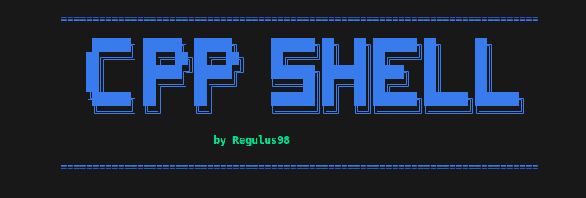

# cpp-shell

Modern C++20, Linux/POSIX-oriented shell that keeps the code small and readable while showcasing process control, parsing, and readline integration.



Table of Contents
-----------------
- [What is it](#what-is-it)
- [Features](#features)
- [How it works](#how-it-works)
- [Prerequisites](#prerequisites)
- [Build](#build)
- [Run](#run)
- [Usage](#usage)
- [History file](#history-file)
- [Roadmap](#roadmap)

## What is it
An educational shell that supports pipelines, redirections, background jobs, GNU readline history/search, and simple builtins. It aims to stay minimal while demonstrating clean POSIX process management and parsing.

## Features
- Colored prompt with current working directory (ANSI escapes marked for readline so reverse search redraws correctly).
- Readline line editing: persistent history, incremental append, `Ctrl+R` reverse search, and tab completion for builtins, `$PATH` executables, and filenames.
- Parser for pipelines (`|`), input/output redirections (`<`, `>`, `>>`), and background execution (`&`).
- Executor built on `fork/execvp`, `pipe`, `dup2`, `setpgid`, and `waitpid`, with basic tracking of background jobs.
- Builtins: `cd`, `pwd`, `exit`, `export`, `unset`, `jobs` (listing only; full control planned).
- Signals: ignores `SIGINT`/`SIGQUIT` at the prompt and reaps child processes to keep the job list current.

## How it works
- `tokenizer.cpp`: splits an input line into tokens with support for quotes and escapes.
- `parser.cpp`: builds a pipeline structure, capturing commands, redirections, and background marker.
- `exec.cpp`: wires up pipes/dup2, forks, sets process groups, executes commands, and waits (or backgrounds).
- `jobs.cpp`: keeps lightweight job records for background processes (foreground control not implemented yet).
- `shell.cpp`: manages the prompt, readline history/completion, builtins, and signal handling.
- `main.cpp`: boots the shell and runs the loop.

## Prerequisites
- Tested on Ubuntu 22.04 with GCC 11 and Clang 14; any C++20 compiler should work.
- Required packages: build tools, CMake, and GNU readline development headers.
- Install examples:
```bash
# Debian/Ubuntu
sudo apt-get update
sudo apt-get install -y build-essential cmake libreadline-dev

# Fedora
sudo dnf install -y @development-tools cmake readline-devel
```

## Build
Requirements: CMake, a C++20 compiler, and GNU readline development headers (`libreadline-dev` on Debian/Ubuntu).
```bash
mkdir -p build
cmake -S . -B build
cmake --build build -j
```

## Run
```bash
./build/cppshell
```

## Usage
```bash
pwd
ls | grep cpp
echo hello > out.txt
cat < out.txt
sleep 3 &
jobs
export FOO=bar
unset FOO
```

## History file
The shell resolves its history file path relative to the built binary. When run as `./build/cppshell`, history is stored in `build/.cppshell_history` and is appended on each command; a full flush happens on exit. If the executable path cannot be resolved, it falls back to `.cppshell_history` in the current working directory.

## Roadmap
- v0.2: full job control (foreground terminal control + `fg/bg`)
- v0.3: expansions `$HOME`, `$?`, globbing
- v0.4: history/line editing alternatives (readline/linenoise), command substitution
- v1.0: tests + CI + docs
